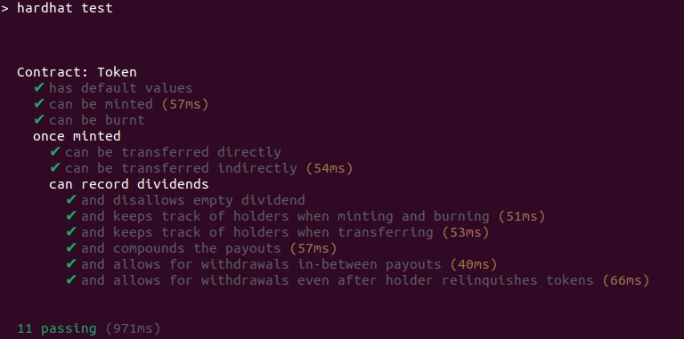

# Tech interview smart contracts coding problem

This is a Solidity coding problem for tech interviews. It is designed to take **no more than a few hours**.

## Getting setup

Ensure you have installed:

- [Node.js](https://nodejs.org/) **v20+**
- [Hardhat](https://hardhat.org/) (already included as a dev dependency)

## Instructions

### 1. Setup

Clone the repo locally and install the NPM dependencies using npm:

### 2. Task

**You only need to write code in the `Token.sol` file. Please ensure all the unit tests pass to successfully complete this part.**

The contracts consist of a mintable ERC-20 `Token` (which is similar to a _Wrapped ETH_ token). Callers mint tokens by depositing ETH. They can then burn their token balance to get the equivalent amount of deposited ETH back.

In addition, token holders can receive dividend payments in ETH in proportion to their token balance relative to the total supply. Dividends are assigned by looping through the list of holders.

Dividend payments are assigned to token holders' addresses. This means that even if a token holder were to send their tokens to somebody else later on or burn their tokens, they would still be entitled to the dividends they accrued whilst they were holding the tokens. 

You will thus need to **efficiently** keep track of individual token holder addresses in order to assign dividend payouts to holders with minimal gas cost.

For a clearer understanding of how the code is supposed to work please refer to the tests in the `test` folder.

Your Solution must pass the test: `npm run test` - run the tests (Hardhat)



## Solution Summary

This repository contains a Solidity/Hardhat technical assessment implementing a simple ETH-backed ERC20-like token with dividend distribution.

### What the contract does
- **Mint:** Users call `mint()` and send ETH. They receive an equal amount of tokens (1 token unit per wei).
- **Burn:** Users call `burn(dest)` to burn their entire token balance and receive the same amount of ETH sent to `dest`.
- **Transfers:** Supports `transfer` and `transferFrom` with allowances.
- **Holders list:** Maintains an on-chain list of current token holders (addresses with non-zero balances).
- **Dividends:** `recordDividend()` accepts ETH and splits it proportionally across current holders based on balances at the time of recording. Each user accumulates a withdrawable dividend amount.
- **Withdrawals:** `withdrawDividend(dest)` allows a user to withdraw their accumulated dividends even if they no longer hold tokens.

### What was missing
The provided `Token.sol` was a stub: core ERC20 functions, mint/burn logic, holder tracking, and dividend accounting were not implemented (functions reverted).

### What I implemented (in Token.sol only)
- ERC20 allowances (`approve`, `allowance`, `transferFrom`)
- Balance transfers with SafeMath
- `mint()` and `burn()` with correct ETH<->token accounting
- O(1) holder tracking using an array + 1-based index mapping with swap-and-pop removal
- Dividend recording proportional to balances at record time and stored as withdrawable per holder
- Dividend withdrawals using checks-effects-interactions to prevent re-entrancy issues

### How to run
```bash
npm install
npm run compile
npm test
