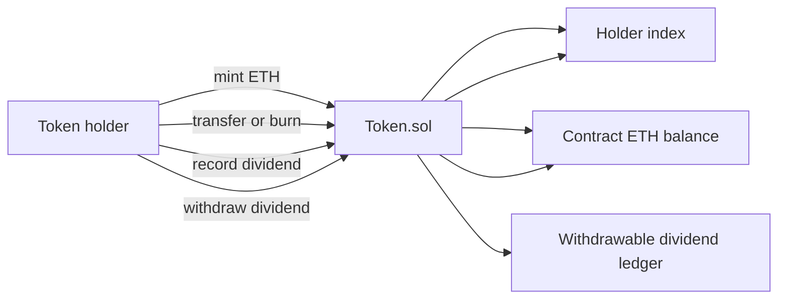
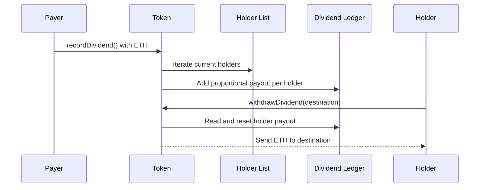

# Architecture

The contract is centered on `Token.sol`, which combines ERC20-style balance accounting, mint/burn backing logic, holder tracking, and dividend withdrawal state.

## Components

- `Token.sol`: main implementation.
- `IERC20.sol`: ERC20-style interface.
- `IMintableToken.sol`: mint/burn interface.
- `IDividends.sol`: dividend interface.
- `SafeMath.sol`: arithmetic safety for Solidity 0.7.0.
- `test/token.test.js`: behavioral coverage for minting, transfers, holder tracking, dividends, and withdrawals.

## Dividend Sequence

## State Model

- `balanceOf`: token balances.
- `totalSupply`: total minted token supply.
- `_allowances`: approved spender balances.
- `_holders`: current non-zero token holders.
- `_holderIndex1`: 1-based index into `_holders` for O(1) holder lookup/removal.
- `_withdrawableDividend`: accrued ETH dividend balance by address.

## Tradeoff

The design makes holder maintenance efficient for transfer and burn operations, but dividend recording is O(n) over current holders.
